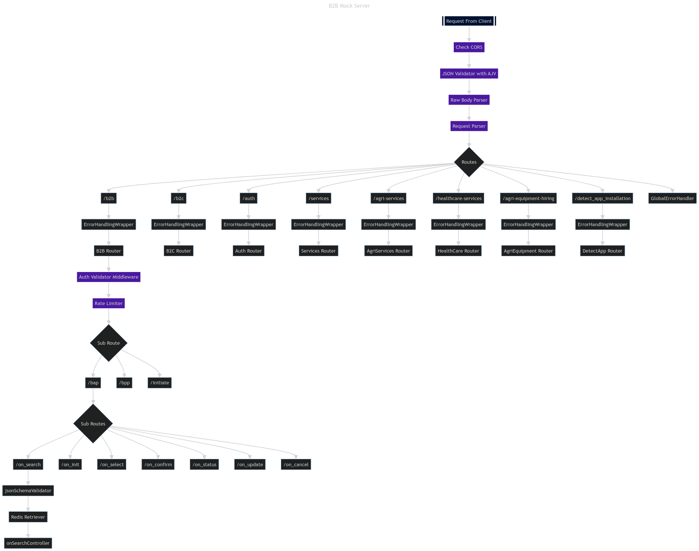

# ONDC Mock & Sandbox
This is the monorepo for the ONDC Mock & Sandbox. It features an ExpressJS Web Server, a Vite ReactJS App. This README specifies the instructions on how to use it.

>NOTE: Currently, the mock server and sandbox support B2B and services domains.

# Mock Server
This service will imitate various API behaviors like search, on_search, select, etc. You may use this server to expedite the implementation of your APIs.
- If you are a buyer app (BAP), you can provide /action APIs payload and you will receive the subsequent sync and async responses.
You'll either get an ACK or NACK as a sync response based on schema validations performed on your provided payload.
If you receive a NACK as sync response, it indicates there are schema errors in your payload that you need to address.
- If you receive an ACK sync response, you'll then get the subsequent async response. For example, if you provided a payload for the /action API, you'll receive an async response for the subsequent /on_action API. A notable feature of this service is the ability to select from various scenarios like location not serviceable, item out of stock, etc.

- If you are a seller app (BPP), you can provide /on_action APIs payload and you will receive the subsequent sync and async request. Once you receive ACK as a sync response, you will receive the subsequent async request. For e.g. if you have provided the payload for /on_action API, then you will receive an async request for next /action API. 

# Sandbox

- In this sandbox environment, you can freely test your APIs. However, to receive successful responses, it's necessary to be subscribed to the staging registry. This server will require and authenticate the authorization header for verification. Once you are subscribed to the staging registry and have developed the APIs, you can test them by providing the payload and authorization header. You may refer to this [document](https://github.com/ONDC-Official/developer-docs/blob/main/registry/signing-verification.md) and use the [utilities](https://github.com/ONDC-Official/reference-implementations/tree/main/utilities/signing_and_verification) to create the authorization header. 

- Like mock server, sandbox will give you a sync as well as async response. You'll either get an ACK or NACK as a sync response based on schema validations applied to your provided payload and verification of authorization header. 

- If you receive a NACK sync response, it indicates there are schema errors in your payload that you need to address or the authorization header could not be verified. On the other hand, if you receive an ACK sync response, the asyn response will be sent back to the respective API end point hosted on your server (bap_uri or bpp_uri sent in context part). For example, if you are BAP and provided a payload for the /action API, you'll receive an async response on the corresponding /on_action API endpoint and vice versa.

- The sandbox will also generate a cURL command or you can create yourself that you can execute directly from the command line interface (CLI) to sandbox environments.

> Host for Buyer instance:
`` https://mock.ondc.org/api/b2b/bap``

> Host for Seller instance:
`` https://mock.ondc.org/api/b2b/bpp``

### Request body
You can refer these [examples](https://github.com/ONDC-Official/ONDC-RET-Specifications/tree/release-2.0.2/api/components/Examples/B2B_json) for request body.

__Note__: All the requests must pass the schema validation based on the examples. You can refer this [log utility](https://github.com/ONDC-Official/reference-implementations/tree/main/utilities/logistics-b2b/log-verification-utility) for the schema validations.

### Response body
1. In the case of schema validation failure, you will receive a `NACK`. A sample `NACK` response is as below:
```json
{
  "message": {
    "ack": {
      "status": "NACK"
    }
  },
  "error": {
    "type": "JSON-SCHEMA-ERROR",
    "code": "50009",
    "message": [
      {
        "message": "must have required property 'domain'"
      }
    ]
  }
}
```
2. In the case of schema validation success 
```json
{
  
    "message": {
      "ack": {
        "status": "ACK"
      }
  },
 ```

# Swagger

Swagger UI can also be used to mock the APIs. The below steps can be followed to use Swagger as a mock or sandbox.

**Choose a server**

There are two type of NPs one is BPP (Seller app) and BAP (Buyer app). 

- All the **actions** calls are hosted on the BPP server. So if you want to make mock requests to BPP, then select _/b2b/bpp_ from the servers dropdown.

- All the **on_actions** calls are hosted on the BAP server. So if you want make mock requests to BAP or the buyer app, then select _/b2b/bap_ from the servers dropdown.

**Make a request**

Since you have selected the desired server, now you can make the requests to that server. There are two serivces available to test with :

- Sandbox
- Mock
  
You can select service from `mode` dropdown.

**Sandbox**

To use the sandbox you need to have an authorization header which is to be passed in the header to make requests. For creating the authorization header you can refer this [document](https://github.com/ONDC-Official/developer-docs/blob/main/registry/signing-verification.md) and use the [utilities](https://github.com/ONDC-Official/reference-implementations/tree/main/utilities/signing_and_verification)

**Mock**

You can use Mock service to mock the requests. It doesn't require authorization header to be passed.

Then choose the API end point you want to mock, click on 'Try it out'. You may use the examples available from the dropdown or use your own. Then click on 'Execute'. 
If you receive a NACK as sync response, it indicates there are schema errors in your payload that you need to address. If you receive an ACK sync response, you'll then get the subsequent async response/request.

In case you use mock service you will receive both `sync` and `async` and in case of sandbox service you will receive only `sync` response with `ACK` and `async` response will be sent back to the respective API end point hosted on your server (bap_uri or bpp_uri sent in context part). 

# Diagrams

**DFD Diagram**



**C2 Diagram**


**C4 Diagram**


